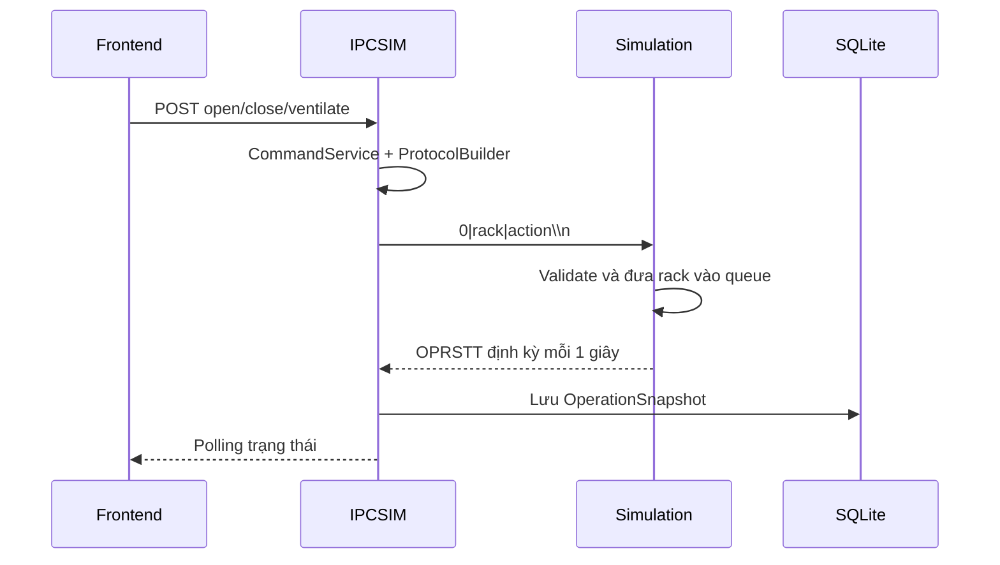

# Đặc tả giao thức IPCSIM và Simulation

## 1. Mục đích và phạm vi

Tài liệu này tổng hợp giao thức truyền thông giữa:

- `IPCSIM`: backend FastAPI, phát lệnh điều khiển, nhận dữ liệu và lưu vào SQLite.
- `Simulation`: mô phỏng master controller/rack, nhận lệnh qua serial và phát trạng thái.
- `Simulation/virtual_serial/virtual_ipc.py`: cầu nối legacy có thể nhận lệnh qua TCP socket rồi chuyển sang serial.

Tài liệu phân biệt **hiện trạng** trong mã nguồn với **chuẩn đích** được đề xuất.

## 2. Kiến trúc kết nối hiện tại

### 2.1. Luồng chính

```mermaid
flowchart LR
    UI[Frontend] -->|HTTP command| API[IPCSIM FastAPI]
    API --> CS[CommandService]
    CS --> PB[ProtocolBuilder]
    PB -->|0\\|rack\\|action\\n| SM[SerialManager]
    SM <-->|pyserial, line-based| SIM[Simulation MasterCom]
    SIM -->|ENVSTT / OPRSTT / BRKSTT| SM
    SM --> L[SerialListener]
    L --> P[ProtocolParser]
    P --> H[Telemetry/Event handlers]
    H --> DB[(SQLite)]
```

IPCSIM và Simulation phải mở **hai đầu của cùng một cặp serial ảo**. Không nên thêm `virtual_ipc.py` vào giữa nếu IPCSIM đã kết nối trực tiếp tới serial.

### 2.2. Luồng legacy có socket trung gian

`virtual_ipc.py` mở TCP server tại cổng `5052`, nhận message theo khung:

```text
[HEADER 64 bytes chứa độ dài message][message UTF-8]
```

Sau đó lớp này ghi message vào serial và đọc phản hồi để lưu dữ liệu. Đây là đường truyền khác với backend IPCSIM hiện tại. Nếu sử dụng đường legacy:

1. Chỉ một tiến trình được sở hữu mỗi cổng COM.
2. Client phải gửi đủ header 64 byte như `virtual_ipc.py` yêu cầu.
3. Không để IPCSIM mở cùng cổng serial.

## 3. Cấu hình serial hiện tại

| Thuộc tính | IPCSIM | Simulation | Ghi chú |
|---|---:|---:|---|
| Port mặc định | `COM2` | Constructor nhận `COM3`, nhưng `MasterCom.start()` ghi đè thành `COM1` | Cần thống nhất |
| Baudrate | `9600` | `9600` | Có thể tăng sau khi đo tải |
| Data bits | 8 | 8 | Mặc định pyserial, nên khai báo tường minh |
| Parity | none | none | Nên khai báo tường minh |
| Stop bits | 1 | 1 | Nên khai báo tường minh |
| Encoding | UTF-8 | UTF-8 | Payload nên giới hạn ở ASCII |
| Kết thúc frame | `\n` | `\n` | `readline()` tách frame |
| Timeout đọc | 1 giây | Tùy nơi khởi tạo | Nên dùng timeout hữu hạn |

### 3.1. Đường đi byte

1. Bên gửi tạo chuỗi không có newline cuối.
2. Bên gửi nối `\n`, encode UTF-8 và ghi xuống serial.
3. Bên nhận gọi `readline()`, decode và loại newline.
4. Parser nhận một chuỗi hoàn chỉnh.

Mọi message phải là **một dòng duy nhất**; JSON không được chứa newline chưa escape.

## 4. Định dạng bản tin hiện tại

### 4.1. Lệnh điều khiển từ IPCSIM sang Simulation

Định dạng:

```text
0|<rack_id>|<action_code>\n
```

| Trường | Kiểu | Ý nghĩa |
|---|---|---|
| `0` | số | Version/nhóm lệnh hiện tại |
| `rack_id` | số nguyên dương | ID rack |
| `action_code` | số | Mã thao tác |

| Tên lệnh backend | Mã | Hành vi |
|---|---:|---|
| `LIGHT_RACK` | `0` | Có trong builder, chưa thấy đường gọi trong `CommandService` |
| `OPEN_RACK` | `1` | Mở rack |
| `CLOSE_RACK` | `2` | Đóng rack |
| `VENTILATE_RACK` | `3` | Thông gió rack |

Ví dụ:

```text
0|5|1\n
```

Simulation xử lý lệnh trong `determine_operationInformation()`, thêm rack vào danh sách thao tác và phát `OPRSTT` mỗi giây.

### 4.2. Telemetry môi trường: `ENVSTT`

```text
ENVSTT|<rack_id>|<temperature>|<humidity>|<weight>|<smoke>\n
```

Ví dụ:

```text
ENVSTT|2|21.35|55.20|78.40|0\n
```

| Trường | Kiểu | Đơn vị/quy ước |
|---|---|---|
| `rack_id` | int | ID rack |
| `temperature` | float | Độ C |
| `humidity` | float | Phần trăm RH |
| `weight` | float | Simulation hiện dùng giá trị quanh 80 |
| `smoke` | 0/1 | `0` bình thường, `1` phát hiện khói |

Simulation hiện phát telemetry cho từng rack rồi chờ `120` giây. Parser IPCSIM chuẩn hóa thêm giá trị boolean/string của smoke khi dùng JSON hoặc legacy.

### 4.3. Trạng thái vận hành: `OPRSTT`

```text
OPRSTT|<rack_id>|<movement_speed>|<displacement>|<is_hard_locked>|<is_endpoint>|<state>\n
```

| Trường | Kiểu | Ý nghĩa |
|---|---|---|
| `rack_id` | int | ID rack |
| `movement_speed` | float | Tốc độ mô phỏng |
| `displacement` | float | Vị trí, mô phỏng khoảng `0..64` |
| `is_hard_locked` | 0/1 | Khóa cứng |
| `is_endpoint` | 0/1 | Đã chạm điểm cuối |
| `state` | int/null | `1` mở, `2` đóng, `3` thông gió, `-1` idle |

Khi đạt endpoint, Simulation đặt `is_endpoint=1`. IPCSIM lưu snapshot; frontend hiện theo dõi bằng polling.

### 4.4. Trạng thái lỗi: `BRKSTT`

```text
BRKSTT|<rack_id>|<is_obstructed>|<is_skewed>|<is_overload_motor>\n
```

Các cờ đều là `0/1`: bị cản trở, lệch cơ cấu và quá tải motor. Simulation có thể phát lặp lại trong trạng thái lỗi; IPCSIM lưu mỗi bản tin thành breakdown snapshot.

### 4.5. ACK hiện tại

Parser chấp nhận:

```text
ACK|<value_1>|<value_2>|...\n
```

IPCSIM chuyển phần sau `ACK` thành `payload["values"]` và gửi đến `AckHandler`. Simulation hiện chưa thể hiện việc phát ACK cho command, nên chưa có xác nhận chắc chắn lệnh đã được nhận, hợp lệ hay bắt đầu xử lý.

### 4.6. JSON tương thích parser

Parser cũng nhận một dòng JSON có trường `type`:

```json
{"type":"telemetry","rack_id":2,"temperature":21.35,"humidity":55.2,"weight":78.4,"smoke":0}
```

Builder hiện ưu tiên pipe format cho command. Không nên trộn hai format trong cùng phiên nếu chưa có negotiation/version rõ ràng.

## 5. Luồng nghiệp vụ



Simulation phát `ENVSTT`, `OPRSTT`, `BRKSTT`; `SerialListener` đọc từng dòng, `ProtocolParser` phân loại, rồi handler ghi snapshot tương ứng. Message sai format hiện bị log là `unknown` hoặc lỗi parse; chưa có retry ở tầng giao thức.

## 6. Vấn đề hiện tại

| Mức độ | Vấn đề | Tác động |
|---|---|---|
| Cao | `MasterCom.start()` ghi đè port thành `COM1`, IPCSIM mặc định `COM2` | Không kết nối hoặc kết nối nhầm |
| Cao | Không có request ID/sequence ID | Không ghép ACK, khó chống lệnh trùng |
| Cao | Chưa có ACK chuẩn từ Simulation | Không phân biệt đã nhận và đang chạy |
| Cao | Không có checksum/CRC và độ dài frame | Nhiễu có thể tạo dữ liệu sai |
| Trung bình | Simulation chưa validate rõ rack/action | Có thể nhận giá trị ngoài phạm vi |
| Trung bình | Nhiều thread có thể ghi cùng serial | Có thể trộn frame khi mở rộng |
| Trung bình | Snapshot append-only và polling cố định | Có thể phình DB hoặc trễ UI |
| Trung bình | `readline()` blocking trong async listener | Có thể giữ event loop khi timeout |
| Thấp | Decode chưa có policy cho byte lỗi | Một byte hỏng có thể mất frame |

## 7. Biện pháp tối ưu

### 7.1. Ưu tiên 1: cấu hình và framing

1. Bỏ hard-code port; dùng biến môi trường thống nhất cho IPCSIM và Simulation.
2. Khai báo tường minh `baudrate`, `bytesize=8`, `parity=NONE`, `stopbits=1`, `timeout=1`, `write_timeout=1`.
3. Dùng chung `encode_frame()`/`decode_frame()`, luôn đúng một newline cuối.
4. Decode với `errors="replace"`, đồng thời đếm lỗi decode.
5. Giới hạn frame, ví dụ `MAX_FRAME_BYTES=512`.

### 7.2. Ưu tiên 2: command contract có ACK

Giữ pipe format để tương thích, nhưng chuẩn mới nên có version, request ID và CRC:

```text
CMD|1|<request_id>|<rack_id>|<action_code>|<timestamp_ms>|<crc16>\n
ACK|1|<request_id>|<status>|<error_code>|<crc16>\n
OPR|1|<request_id>|<rack_id>|<state>|<speed>|<displacement>|<endpoint>|<crc16>\n
ENV|1|<sequence>|<rack_id>|<temperature>|<humidity>|<weight>|<smoke>|<crc16>\n
BRK|1|<sequence>|<rack_id>|<obstructed>|<skewed>|<overload>|<crc16>\n
```

Quy tắc:

- `request_id` duy nhất cho mỗi command, dùng để ghép ACK/kết quả.
- `sequence` tăng dần theo nguồn phát để phát hiện mất hoặc lặp frame.
- `crc16` tính trên phần trước trường CRC; frame sai bị loại.
- ACK tối thiểu có `RECEIVED`, `ACCEPTED`, `REJECTED`, `BUSY`, `DONE`, `FAILED`.
- IPCSIM vẫn ghi `received_at` phía server, không phụ thuộc hoàn toàn vào timestamp thiết bị.

Parser chuyển tiếp nên nhận cả format cũ và mới; builder dùng feature flag trong giai đoạn chuyển đổi.

### 7.3. Ưu tiên 3: quản lý lệnh và trạng thái

- Một command queue tập trung ở IPCSIM; mỗi rack tối đa một thao tác đang chạy.
- Dùng `asyncio.Lock` hoặc một writer task duy nhất cho serial.
- Có timeout ACK và timeout tổng thao tác.
- Retry có giới hạn, chỉ retry khi chưa nhận `RECEIVED`; không retry mù lệnh có tác động vật lý.
- Simulation ACK ngay sau validate rồi phát event tiến trình và event hoàn tất.
- Reject rõ rack ngoài phạm vi, action lạ, rack bận hoặc rack đang lỗi.

### 7.4. Ưu tiên 4: giảm tải DB và UI

- Phát `OPRSTT` 1 Hz khi rack chạy; khi idle chỉ phát heartbeat hoặc event thay đổi.
- Chỉ lưu telemetry khi vượt ngưỡng thay đổi hoặc theo sample interval cố định.
- Batch insert khi nhận burst nhiều rack.
- Thêm index `(rack_id, created_at)` cho bảng snapshot.
- Dùng WebSocket/SSE cho realtime khi backend có endpoint ổn định; giữ REST cho lịch sử.

### 7.5. Ưu tiên 5: quan sát và an toàn

Mỗi frame nên có log cấu trúc gồm `direction`, `message_type`, `rack_id`, `request_id/sequence`, `parse_result`, `latency_ms`. Metric cần có: frame RX/TX, parse/CRC/decode error, ACK timeout/retry/reject, latency command-to-ACK/DONE, mất sequence và thời gian disconnect/reconnect.

## 8. Kiểm tra tính đúng đắn

### 8.1. Ma trận test parser

| Nhóm | Trường hợp |
|---|---|
| Command | action 0/1/2/3, rack hợp lệ, rack âm/rỗng, action lạ |
| ENVSTT | số thực, thiếu trường, smoke `0/1/true/false`, giá trị sai |
| OPRSTT | có/không có `state`, endpoint 0/1, displacement 0/64 |
| BRKSTT | từng cờ lỗi, thiếu trường, cờ ngoài 0/1 |
| Framing | dòng rỗng, nhiều newline, frame quá dài, UTF-8 lỗi |
| Compatibility | JSON tương đương pipe, type lạ, ACK nhiều giá trị |

### 8.2. Test tích hợp serial

1. Tạo cặp COM ảo và xác nhận hai tiến trình mở đúng hai đầu.
2. Gửi `0|2|1\n`, kiểm tra Simulation bắt đầu mở rack 2.
3. Xác nhận nhận `OPRSTT` và frame endpoint.
4. Gửi rack không hợp lệ, xác nhận ACK reject sau khi bổ sung ACK.
5. Ngắt một đầu serial, đo phát hiện và reconnect.
6. Gửi burst telemetry, kiểm tra mất frame và thời gian DB lock.

### 8.3. Tiêu chí chấp nhận

- Không có hai process cùng sở hữu một COM pair.
- 100% command hợp lệ nhận `RECEIVED` trong timeout cấu hình.
- Frame sai không tạo snapshot sai dữ liệu.
- Trùng `request_id` không làm thao tác chạy hai lần.
- Mất kết nối hiển thị offline và tự phục hồi.
- Parser vẫn xử lý bản tin cũ trong thời gian chuyển đổi.

## 9. Lộ trình triển khai

### Giai đoạn 1: cấu hình và test

- Loại hard-code `COM1` ở Simulation.
- Đưa port/baudrate/timeout vào cấu hình.
- Thêm unit test parser và test cặp COM ảo.

### Giai đoạn 2: ACK và validation

- Thêm request ID, ACK `RECEIVED/REJECTED` và range validation.
- Thêm state machine command ở IPCSIM.
- Giữ bản tin legacy để không phá Simulation hiện tại.

### Giai đoạn 3: tin cậy và hiệu năng

- Thêm sequence, CRC16, giới hạn frame và reconnect backoff.
- Tách serial I/O khỏi event loop bằng thread/async serial phù hợp.
- Batch persistence, index database và giảm polling.

### Giai đoạn 4: realtime và vận hành

- Bật WebSocket/SSE cho trạng thái đang chạy.
- Bổ sung metric/log cấu trúc và dashboard sức khỏe kết nối.
- Chạy soak test dài với nhiều rack đồng thời.

## 10. Checklist vận hành

- [ ] IPCSIM và Simulation dùng đúng cặp COM, không bị hard-code khác nhau.
- [ ] Hai đầu có cùng baudrate và thông số 8-N-1.
- [ ] Mỗi frame có newline và không vượt giới hạn kích thước.
- [ ] Rack ID được kiểm tra trước khi gửi và thực thi.
- [ ] Có log TX/RX theo request ID hoặc sequence.
- [ ] Có timeout, reconnect và trạng thái offline rõ ràng.
- [ ] Database có index cho truy vấn snapshot mới nhất.
- [ ] Test legacy và chuẩn mới chạy trong CI trước khi đổi feature flag.

## 11. Mã nguồn tham chiếu

- `IPCSIM/app/serial/serial_manager.py`: mở cổng, gửi và đọc frame.
- `IPCSIM/app/serial/protocol/builder.py`: tạo lệnh `0|rack|action`.
- `IPCSIM/app/serial/protocol/parser.py`: parse pipe format và JSON.
- `IPCSIM/app/serial/listener.py`: dispatch telemetry/event/ACK.
- `IPCSIM/app/services/communication/command_service.py`: phát command từ backend.
- `Simulation/virtual_serial/virtual_master_controller.py`: tạo trạng thái và xử lý command.
- `Simulation/virtual_serial/virtual_ipc.py`: cầu nối socket-to-serial legacy.